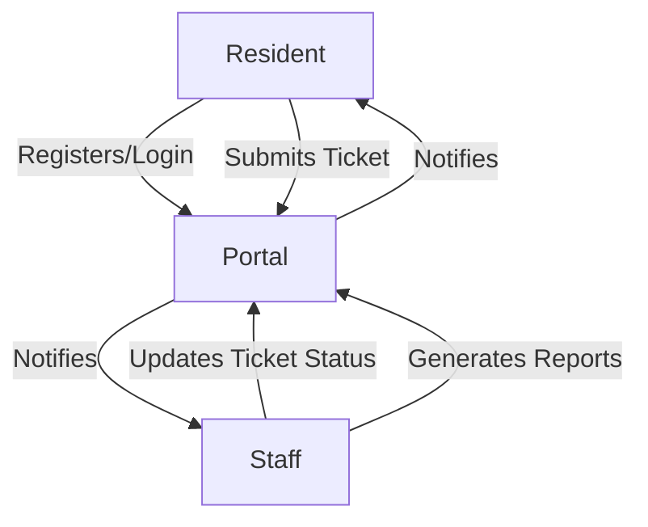

# Barangay Transaction Portal

A web-based application for managing barangay transactions, records, and resident information.

---

## 📢 New Update

### Barangay Request and Complaint Management System Update

**Resident Care Portal Enhancements:**
- Introduced a comprehensive Frequently Asked Questions section to assist residents with common inquiries.
- Published the Barangay Safety Regulations to promote community awareness and compliance.
- Rolled out a Feedback Survey to gather insights and improve resident engagement.
- Added a clear and concise Terms and Conditions page outlining platform usage policies.

**Helpdesk Improvements:**
- Refactored role management: The system now supports scalable role-based access control, allowing easy addition of new roles and permissions to support future growth.
- Implemented a Manage Announcements Headline feature for streamlined communication.
- Launched a dedicated Feedback Dashboard to monitor and evaluate resident input efficiently.

---

## Features

### Dashboard (Residents)
- User registration and login
- View and update personal profile
- Submit complaints and requests (ticketing system)
- View status and history of submitted tickets
- Receive notifications and messages from barangay staff
- Download barangay certificates and clearances (if approved)
- View barangay announcements and transparency reports
- Showcase of resolved tickets display
- Logout functionality

### Helpdesk (Barangay Staff)
- Staff login and authentication
- View dashboard with ticket summary and statistics
- View, filter, and manage all resident tickets (complaints/requests)
- Update ticket status (e.g., pending, in progress, resolved)
- Send messages/notifications to residents
- Manage resident accounts (view, update, search)
- Generate and download reports
- Manage and showcase resolved tickets display
- Upload and manage display images for resolved tickets
- Staff account management (create, update, deactivate)
- Logout functionality

## Technologies Used

- PHP (XAMPP/LAMPP stack)
- MySQL/MariaDB
- HTML, CSS, JavaScript

## Project Structure

```
brgy_tx_prot/
│
├── index.php
├── README.md
├── functions.php
│
├── config/
│   ├── auth.php
│   ├── database.php
│   └── staff-auth.php
│
├── public/
│   ├── css/
│   │   ├── admin.config-view.css
│   │   ├── admin.gen-report.css
│   │   ├── admin.navbar.css
│   │   ├── admin.shared-styles.css
│   │   ├── admin.summary.css
│   │   ├── admin.ticket.section.css
│   │   ├── dashboard.ticket-form.css
│   │   ├── index.content.css
│   │   ├── index.footer.css
│   │   ├── index.navbar.css
│   │   ├── index.shared-styles.css
│   ├── images/
│   │   ├── barangay.svg
│   │   ├── brgy-bg.jpg
│   │   ├── card1.png
│   │   ├── card2.png
│   │   ├── card3.png
│   │   ├── card4.png
│   │   ├── headline-contacts.png
│   │   ├── headline-first.png
│   │   ├── headline-fourth.png
│   │   ├── headline-second.png
│   │   ├── headline-third.png
│   ├── js/
│   │   ├── clock.js
│   │   ├── login-signupToggle.js
│   │   ├── mobile-menu.js
│   │   ├── reg-confirm-pass.js
│   │   ├── searchtable.js
│   │   ├── sorttable.js
│   │   ├── status-colorcode.js
│   │   └── toggle-edit.js
│
├── router/
│   └── router.php
│
├── src/
│   ├── controllers/
│   │   ├── adminCreateStaffController.php
│   │   ├── adminLoginController.php
│   │   ├── adminLogoutController.php
│   │   ├── adminSendMessageController.php
│   │   ├── adminUpdateDisplayController.php
│   │   ├── adminUpdateResidentController.php
│   │   ├── adminUpdateStaffController.php
│   │   ├── adminUploadDisplayController.php
│   │   ├── getMessagesController.php
│   │   ├── residentLoginController.php
│   │   ├── residentLogoutController.php
│   │   ├── residentSendMessageController.php
│   │   ├── residentSignupController.php
│   │   ├── ticketController.php
│   │   └── ticketUpdateController.php
│   ├── models/
│   │   ├── DisplayTicket.php
│   │   ├── Resident.php
│   │   ├── Staff.php
│   │   ├── Ticket.php
│   │   └── TicketLog.php
│
├── views/
│   ├── index.view.php
│   ├── login.php
│   ├── dashboard/
│   │   ├── index.php
│   │   ├── submission.php
│   │   ├── tickets.php
│   │   └── partials/
│   │       ├── ticket-card.php
│   │       ├── ticket-submission-form.php
│   │       └── ticket-table-resolved.php
│   ├── helpdesk/
│   │   ├── generate-report.php
│   │   ├── index.php
│   │   ├── login.php
│   │   ├── view-ticket.php
│   │   ├── configuration-view/
│   │   │   ├── index.php
│   │   │   └── partials/
│   │   │       ├── 404.php
│   │   │       ├── aside.php
│   │   │       ├── create-staff-account.php
│   │   │       ├── manage-resident-accounts.php
│   │   │       └── manage-staff-accounts.php
│   │   └── partials/
│   │       ├── dashboard.php
│   │       ├── html.head.php
│   │       ├── navbar.php
│   │       ├── section.summary.php
│   │       └── ticket-table.php
│   └── partials/
│       ├── brgy-transparency.php
│       ├── footer.php
│       ├── head-ticket.php
│       ├── head-title.php
│       ├── headline.php
│       ├── html.head.php
│       ├── login-register.php
│       ├── mission-vision.php
│       ├── navbar.php
│       ├── newnav.php
│       └── ticket-table-resolved.php
```

## System Flow

The Barangay Transaction Portal operates with two main user roles: Residents and Barangay Staff. Below is a high-level overview of the system flow:

### 1. Resident Flow
- **Registration/Login:** Residents create an account or log in.
- **Ticket Submission:** Residents submit complaints or requests via a ticketing system.
- **Ticket Tracking:** Residents monitor the status and history of their tickets.
- **Notifications:** Residents receive updates and messages from staff.
- **Logout:** Residents can securely log out.

### 2. Barangay Staff Flow
- **Staff Login:** Staff members authenticate to access the helpdesk.
- **Dashboard Access:** Staff view ticket summaries and statistics.
- **Ticket Management:** Staff review, filter, and update the status of all tickets.
- **Resident Management:** Staff manage resident accounts and information.
- **Communication:** Staff send notifications and messages to residents.
- **Report Generation:** Staff generate and download various reports.
- **Resolved Tickets Showcase:** Staff manage and display resolved tickets.
- **Staff Account Management:** Admins create, update, or deactivate staff accounts.
- **Logout:** Staff can securely log out.

### 3. Data Flow Diagram



## Installation

1. Clone or download the repository to your XAMPP/LAMPP `htdocs` directory.
2. Import the provided SQL database into your MySQL server.
3. Update database credentials in the configuration files (config/database.php) if necessary.
4. Start Apache and MySQL services.
5. Access the application via `http://localhost/brgy_tx_prot/`.

## Usage

- Login as Admin, Staff, or Resident.
- Manage residents, process requests, and generate reports as needed.

## Contributing

Pull requests are welcome. For major changes, please open an issue first.

## License

This project is licensed under the PUP License.
